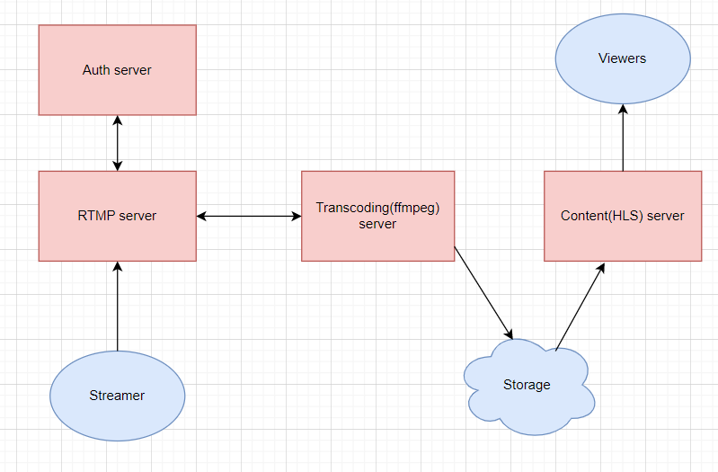
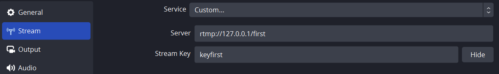

# Spring streaming service

## Introduction
This project is a development of a small microservice based streaming
service.




It's built on Spring Webflux. 
RTMP server implemented as Reactor Netty TCP server bean.
Transcoding server uses java process builder to start ffmpeg process
which transcodes RTMP stream to HLS stream and saves it to storage
(Docker volume in this implementation). Then content server serves
HLS files to viewers.

## How to use
Download project, change folder and execute command

`docker compose up -d`

After this you can start streaming with OBS client.



There are two initial users in a database. 
You can use these predefined credentials to connect to RTMP server.
Then you can consume RTMP stream(VLC player for example) 
or HLS stream in a browser. 

To test stream in a browser you can open following html file:

```
<script src="https://cdn.jsdelivr.net/npm/hls.js@1/dist/hls.min.js"></script>
<video id="video" controls style="width: 80%"></video>
<script>
  var video = document.getElementById('video');
  var videoSrc = 'http://127.0.0.1:8081/streams/first/master.m3u8';
  if (Hls.isSupported()) {
    console.log('HLS SUPPORTED');
    var hls = new Hls();
    hls.loadSource(videoSrc);
    hls.attachMedia(video);;
  }
  else if (video.canPlayType('application/vnd.apple.mpegurl')) {
    video.src = videoSrc;
  }
</script>
```
## TODO
- Add tests
- Implement twitch like room-based chat with websockets
- Add React frontend
- ...
